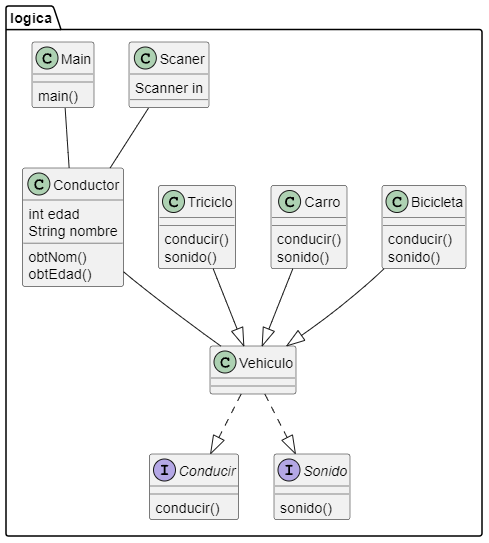

# Diagrama de clases con PlantUml
A partir de un sencillo codigo con el cual se muestras el manejo de clases y de los conceptos de solid se realizo el diagrama expuesto a continuacion 

## diagrama del codigo
